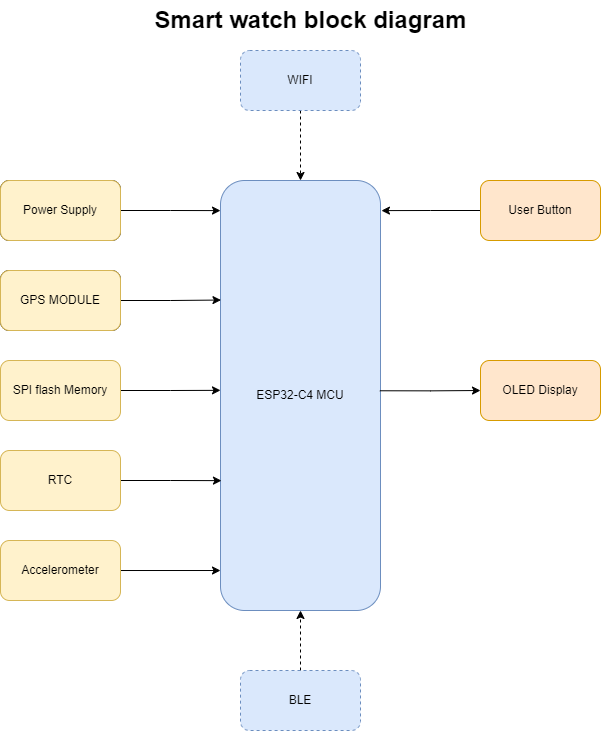

# IEEE-smart-watch
Smart watch project for IEEE embedded design classes

## General features 
The smart watch features the following:
1. Time 
2. GPS
3. WIFI
4. Bluetooth
5. Accelerometer activity monitoring 
6. Flash memory 
7. OLED mini display

### Block diagram

### Time 
The watch shall be able to tell time accurately based on the Network
Time Protocol(NTP).It should also be able to maintain accurate time 
when it is disconnected from the Internet, using Real Time Clock(RTC).  
This time shall be rendered on the OLED display

### GPS
Global positioning system shall be used to tell the user's location accurately.  
The GPS chip used must be as small as possible to fit within the size constraints.

### WIFI
The watch shall be able to connect to WIFI available network using WiFi Provision Methods to 
allow the user to select the network using their phone since the watch shall not feature a keypad.

### Bluetooth 
The watch shall feature BLE. This shall be strictly Low Energy to allow the watch to maintain the battery
for long periods of time without needing recharge. BLE shall allow for integration with android apps for other 
extended features

### Accelerometer activity monitoring 
An accelerometer will be added to allow for monitoring of physical activity of the user, such as step count,
shocks, falls, hand orientation, AI gestures etc..

### Flash memory 
Flash memory shall be used to store config data for different subsystems and other facilities that need ample storage

### OLED Mini display
Display shall be used to render information such as time, Location, step count etc.The screen must be strictly 
OLED. 

## Software features and requirements 
i) Time acquisition and display in 12HR and 24HR format, configurable by the user  
ii) Network time protocol  
iii) Real Time Clock     
iv) GPS latitude and longitude   
v) GPS time   
vi) GPS elevation   
vii) WIFI network connection  
viii) WIFI Provisioning   
ix) BLE, can be turned ON/OFF by the user and goes inactive if no device is connected and/or   
user forgot to turn it off  
x) BLE Services  
xi) Step count   
xii) Shock detection  
xiii) Fall detection   
xiv) Display  
x) User selectable menu

## Hardware features and requirements 

### Power supply
The watch must use a 3.7V, >500mAh battery capable of being recharged and small enough to fit inside a wristwatch according 
to standards

### Processor 
The processor shall feature WIFI and BLE in-chip.

### Accelerometers
The accelerometer used must be capable of shock detection 

### 

## Appendix